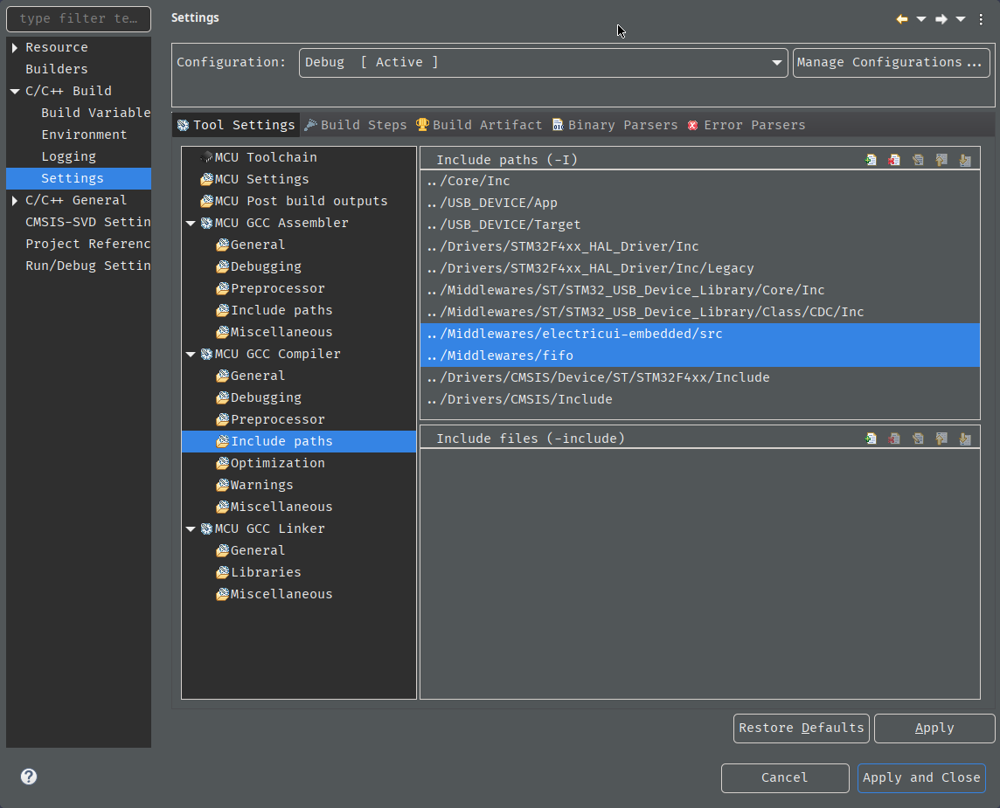
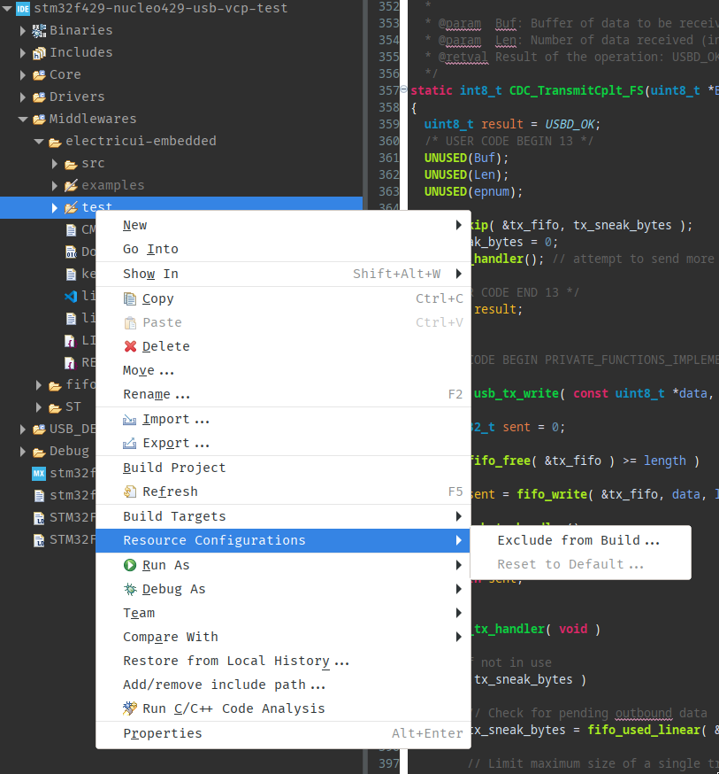
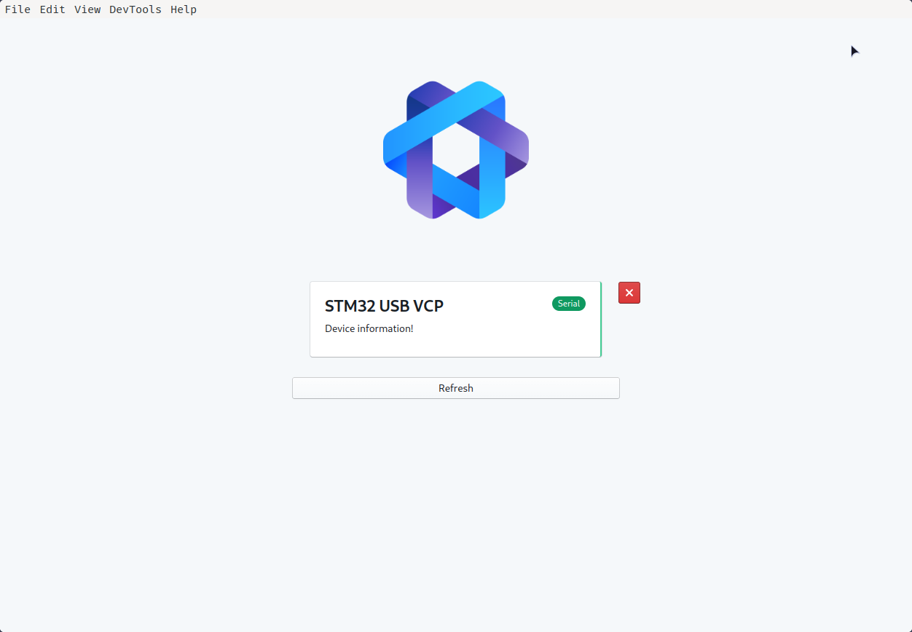

# STM32 USB VCP with Electric UI 
A barebones STM32 CubeMX project implementing native USB communications with Electric UI.

This demo replicates the `hello-blink` example and blinks the `STM32F429 Nucleo-144` green LED `LD1` with a user controllable rate.

The key areas of interest for this demo are in `/USB_DEVICE/App/usbd_cdc_if.c`:

- Implemented FIFO (ringbuffers) for RX and TX.
- Some (common) minor changes to correctly implement line coding behaviour for Windows VCP stability.
- `main.c` polls against the USB RX FIFO and parses bytes as they become available, and writes packets against the USB TX FIFO.
- When the TX FIFO has data, it sends (configurable) chunks with the normal `CDC_Transmit_FS`  behaviour, and waits for completion callback before sending more data.

## Setup

- A copy of the [`electricui-embedded`](https://github.com/electricui/electricui-embedded) library is needed. I put my copy in `/Middlewares`. At time of creation this was version `0.8`.
- I've included ST's generated copy of the HAL in the repo to keep things easy - this was version `1.28.0`.

Some minimal CubeIDE configuration was required:

- Set import paths for the `electricui-embedded` and `fifo` libraries.
  

- You might need to exclude the `electricui-embedded/test` and `examples` directories from the build. Either delete them, or mark them as excluded in the file tree.
  

  

When working correctly, the firwmare replicates the `hello-blink` behaviour and should appear in the connections manager as normal.

> This repo was created as part of reproducing the root cause of some UI connection issues - unimplemented **CDC_SET_CONTROL_LINE_STATE** behaviour seems to be the issue. When/if resolved on the firmware side this repo will be updated and this note updated.

